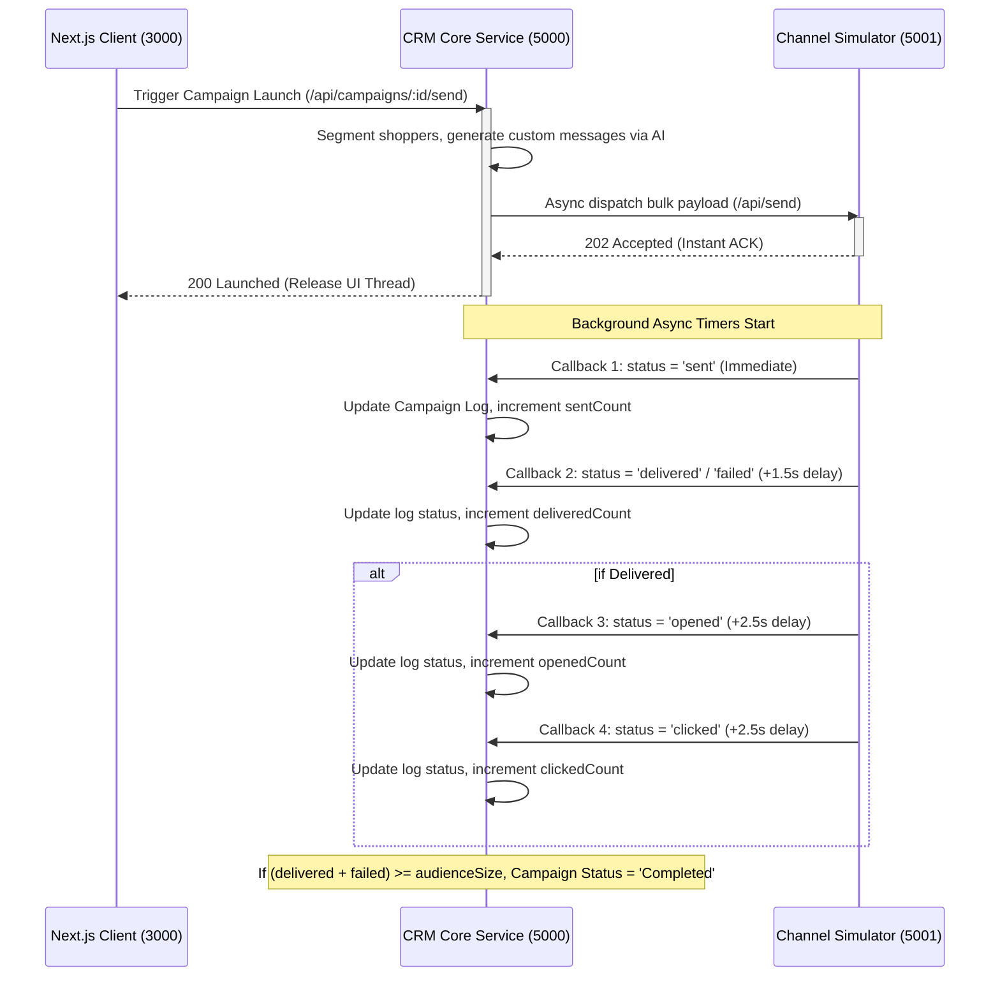

# Xeno AI Campaign Copilot CRM

Live Link : https://frontend-eight-vert-45.vercel.app/

An AI-native Marketing Engagement CRM and Shopper Segmentation platform built for the Xeno Engineering Internship Assignment 2026. This platform allows marketers to describe business goals in natural language, automatically parses segments, drafts personalized messages, and runs message delivery simulations using an asynchronous channel service callback loop.

---

## 🚀 Key Features

*   **AI Campaign Builder**: Parse natural language goals (e.g. *"Re-engage coffee buyers who spent above ₹500 but haven't ordered in 30 days"*) to automatically configure audience queries.
*   **Hyper-Personalization Engine**: Custom message generation tailored to each customer’s transaction history (last item bought, total spending, and inactivity days).
*   **Dual Database Layer**: Connected to MongoDB via Mongoose, but transparently falls back to a local JSON database file (`datastore.json`) if MongoDB is unavailable, ensuring **zero-setup execution**.
*   **Intelligent Mock AI Parser**: Works out-of-the-box in key-free local Mock Mode (parsing goals with smart regex and rules), or connects directly to the Google Gemini API when configured.
*   **Dual-Theme Layout**: Full light and dark mode toggles modeled after premium enterprise data boards (crisp slate layout for light mode, frosted space glassmorphism for dark mode).
*   **Asynchronous Channel Simulator**: Mimics actual message delivery APIs (WhatsApp, Email, SMS). Dispatches messages instantly and returns background callbacks (sent $\rightarrow$ delivered/failed $\rightarrow$ opened $\rightarrow$ clicked) to the CRM webhooks.
*   **Live Webhook Console**: A terminal-like dashboard widget displaying real-time incoming simulator callbacks and campaign metric trackers.

---

## 🛠️ Technology Stack

*   **Frontend**: Next.js 16 (App Router), React 19, Tailwind CSS v4, Lucide Icons, Custom SVG charts.
*   **Backend**: Node.js, Express.js, TypeScript.
*   **Database**: MongoDB (Mongoose) + local JSON file fallback.
*   **AI SDK**: Google Generative AI (Gemini 1.5 Flash).

---

## 📂 Project Structure

```text
XENO/
├── backend/
│   └── crm-core/                   # CRM Core Backend (Port 5000)
│       ├── src/db/connection.ts    # Mongoose schemas & JSON DB Repository
│       ├── src/services/aiService  # Gemini Live & Local Mock AI Parser
│       └── src/routes/api.ts       # REST Ingestion, Campaigns & Callback routes
├── channel-service/                # Channel Simulator Service (Port 5001)
│   └── src/index.ts                # Delayed callback loops mimicking brokers
└── frontend/                       # Next.js 16 Client App (Port 3000)
    ├── src/app/page.tsx            # Main tabbed workspace layout
    ├── src/lib/api.ts              # API HTTP contracts
    └── src/app/globals.css         # Styling system & dark/light modes
```

---

## ⚙️ Running Locally

### Step 1: Configure Environment variables
Create a `.env` file inside `backend/crm-core`:
```env
PORT=5000
MONGO_URI=mongodb://localhost:27017/xeno-crm
GEMINI_API_KEY=
SIMULATOR_URL=http://localhost:5001
```

Create a `.env` file inside `channel-service`:
```env
PORT=5001
```

### Step 2: Run Services
Launch each service in a separate terminal:

**Terminal 1: Channel Simulator**
```bash
cd channel-service
npm install
npm run dev
```

**Terminal 2: CRM Core Service (Auto-seeds on startup)**
```bash
cd backend/crm-core
npm install
npm run dev
```

**Terminal 3: Next.js Client**
```bash
cd frontend
npm install
npm run dev
```

Open your browser to: **[http://localhost:3000](http://localhost:3000)**.

---

## 🔄 Webhook Callback Lifecycle


